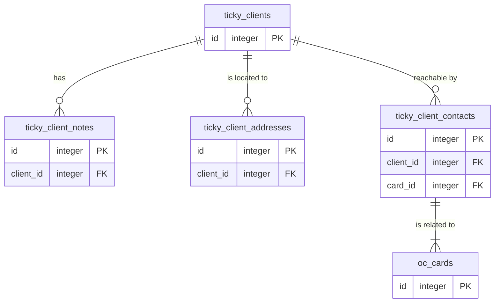

# Database documentation

## ER Diagram

## Table: ticky_clients
Client / customer informations

| Column | Type | Options | Constraints | Meaning |
|---|---|---|---|---|
| id | integer | autoincrement, unsigned | PK | Client identifier |
| uuid | string | length=36, notnull | Unique IDX | Client external identifier |
| client_number | string | length=36, notnull | Unique IDX | Client number |
| name | string | length=255, notnull |  | Client name |
| type | string | length=32, notnull, default=company |  | Client type |
| status | string | length=32, notnull, default=lead |  | Client status: lead, active, inactive |
| contact_email | string | length=255 |  | Client contact email address |
| invoice_email | string | length=255 |  | Client invoice email address |
| phone | string | length=64 |  | Client contact phone number |
| website | string | length=255 |  | Client website URL |
| vat_id | string | length=32 |  | ??? |
| tax_number | string | length=64 |  | ??? |
| register_court | string | length=255 |  | ??? |
| register_number | string | length=64 |  | ??? |
| nc_file_id | integer | unsigned |  | ??? |
| nc_folder_path | string | length=512 |  | ??? |
| created_at | datetime |  |  | Client record create date |
| updated_at | datetime |  |  | Client record update date |

## Table: ticky_client_notes
Client / customer notes

| Column | Type | Options | Constraints | Meaning |
|---|---|---|---|---|
| id | integer | autoincrement, unsigned | PK | Client note identifier |
| client_id | integer | unsigned, notnull | FK CascadeDelete | Client identifier |
| user_id | string | length=64, notnull |  | Client identifier |
| type | string | length=32, default=note |  | Client note type |
| title | string | length=255 |  | Client note title |
| content | text | notnull |  | Client note content |
| created_at | datetime |  |  | Client note record create date |
| updated_at | datetime |  |  | Client note record update date |

## Table: ticky_client_addresses
Client / customer addresses

| Column | Type | Options | Constraints | Meaning |
|---|---|---|---|---|
| id | integer | autoincrement, unsigned | PK | Client address identifier |
| client_id | integer | unsigned, notnull | FK CascadeDelete | Client identifier |
| type | string | length=32, default=main | IDX (with client_id) | Client address type |
| label | string | length=255 |  | Client address label |
| street | string | length=255, notnull |  | Client address street name |
| house_number | string | length=32 |  | Client address house number |
| address_addition | string | length=255 |  | Client address addition |
| postal_code | string | length=32, notnull |  | Client address postal code |
| city | string | length=255, notnull |  | Client address city name |
| country_code | string | length=2, default=DE |  | Client address country code |
| created_at | datetime |  |  | Client address record create date |
| updated_at | datetime |  |  | Client address record update date |

## Table: ticky_client_contacts
Client / customer contacts

| Column | Type | Options | Constraints | Meaning |
|---|---|---|---|---|
| id | integer | autoincrement, length=11 | PK | Client contact identifier |
| client_id | integer | unsigned, notnull | FK CascadeDelete | Client identifier |
| card_id | integer | length=11, notnull | FK | Nextcloud contact identifier |
| created_at | datetime |  |  | Client contact record create date |
| updated_at | datetime |  |  | Client contact record update date |

Why no cascaded delete for oc_card?